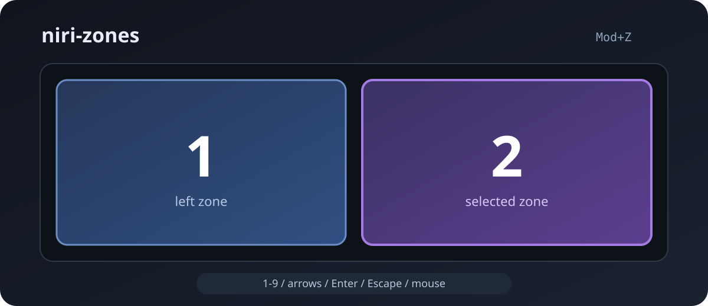

<div align="center">

# niri-zones

**FancyZones-подобный менеджер зон для Niri**

Нативный Wayland overlay для быстрого размещения окон по зонам через Niri IPC.

[English](README.md) · [Русский](README.ru.md)

[](https://github.com/t1ktakdev/niri-zones/actions/workflows/ci.yml)
[](https://github.com/t1ktakdev/niri-zones/releases/latest)
[](LICENSE)




</div>

---

## Что это

Нажимаешь горячую клавишу, выбираешь зону — активное окно становится ровно в выбранное место.

```text
Mod+Z
  ↓
┌─────────────────────────────────────────┐
│  ╭────────────────╮ ╭────────────────╮  │
│  │       1        │ │       2        │  │
│  │                │ │                │  │
│  ╰────────────────╯ ╰────────────────╯  │
└─────────────────────────────────────────┘
  ↓
1 / 2 / стрелки / мышь
  ↓
окно перемещается в выбранную зону
```

Overlay и реальное перемещение окна используют **один и тот же движок геометрии**, поэтому превью соответствует итоговому расположению окна.

## Возможности

| Возможность | Статус |
| --- | --- |
| Нативный Wayland layer-shell overlay | ✅ |
| Выбор с клавиатуры: 1–9, стрелки, Enter, Escape | ✅ |
| Наведение и выбор мышью | ✅ |
| Половины / трети / четверти / main-stack | ✅ |
| Возврат окна в исходное состояние | ✅ |
| Явный tiled → floating переход | ✅ |
| Повторный snap без лишних IPC-команд | ✅ |
| Niri event stream | ✅ |
| Версионируемый TOML-конфиг | ✅ |
| Реальная проверка на нескольких мониторах | ⏳ |
| Реальная проверка fractional scale | ⏳ |
| Drag-to-snap | Пока нет |

## Быстрый старт

### 1. Установка

Скачай Linux x86_64 архив со страницы [Releases](https://github.com/t1ktakdev/niri-zones/releases/latest), распакуй и установи бинарник:

```bash
install -Dm755 niri-zones ~/.local/bin/niri-zones
```

Или собери из исходников:

```bash
git clone https://github.com/t1ktakdev/niri-zones.git
cd niri-zones
cargo build --release
install -Dm755 target/release/niri-zones ~/.local/bin/niri-zones
```

### 2. Проверка Niri

```bash
niri-zones doctor
```

### 3. Запуск overlay

```bash
niri-zones show --layout halves --float
```

Управление:

- `1..9` — сразу выбрать зону
- `← ↑ ↓ →` — переключить выбранную зону
- `Enter` — подтвердить
- `Escape` — закрыть без перемещения
- левый клик — выбрать зону под курсором

### 4. Горячая клавиша Niri

Добавь в binds своего Niri-конфига:

```kdl
Mod+Z repeat=false { spawn "niri-zones" "show" "--float"; }
```

Сам `niri-zones` конфиг Niri автоматически не изменяет.

## Команды

```bash
niri-zones doctor
niri-zones status
niri-zones list halves
niri-zones show --layout halves --float
niri-zones move 2 --layout halves --float
niri-zones restore
```

## Встроенные раскладки

- `halves` — две половины
- `thirds` — три колонки
- `quarters` — четыре зоны
- `main-stack` — большая основная зона + стек

Свои раскладки можно задавать через TOML-конфиг.

## Конфигурация

Скопируй пример:

```bash
mkdir -p ~/.config/niri-zones
cp examples/config.toml ~/.config/niri-zones/config.toml
```

Правила выбираются детерминированно: сначала priority, затем специфичность, затем порядок в файле. Некорректные regex и зоны отклоняются до активации конфига.

## Как устроено

Проект разделён на небольшие Rust crates:

- **zones-core** — геометрия, layouts, выбор направления и snap-state
- **zones-config** — TOML schema, validation и compiled rules
- **zones-niri** — адаптер Niri 26.04 IPC
- **zones-overlay** — Wayland/wlr-layer-shell overlay
- **niri-zones** — CLI

Зоны хранятся как нормализованные координаты `0..1` и переводятся в пропорциональные операции Niri относительно рабочей области. Gap применяется в логических пикселях.

## Требования

- Niri 26.04
- Wayland
- `libxkbcommon`
- Rust 1.86+ только для сборки из исходников

## Текущие ограничения

- Реальный multi-monitor пока не проверен на физической системе с несколькими outputs.
- Fractional scale и повёрнутые мониторы требуют дополнительной живой проверки.
- Drag-to-snap намеренно не сделан через глобальные input hacks.
- Пока нет постоянно работающего daemon и автоматического размещения по rules.

Подробнее: [ROADMAP](docs/ROADMAP.md) и [ARCHITECTURE](docs/ARCHITECTURE.md).

## Разработка

```bash
cargo fmt --check
cargo check --workspace --all-targets --all-features
cargo clippy --workspace --all-targets --all-features -- -D warnings
cargo test --workspace --all-features
cargo build --workspace --release
```

## Участие в разработке

Смотри [CONTRIBUTING.md](CONTRIBUTING.md).

## Лицензия

MIT — [LICENSE](LICENSE).
